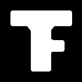

# TopicFriends 

Open source Angular app that connects people with similar interests and goals. 

## Getting Started

Project is currently running on Angular 5. Located in NMWeb

### Prerequisites

Latest versions of NodeJS.
Project runs currently on Angular 5


### Installing

1. Enter NMWeb to install dependencies with NodeJS.
```
cd NMWeb
npm i
```
2. Run the project from within NMWeb:

```
ng serve --open
```


## Running the tests

### Unit tests
...

### End to end tests

We use TestCafe instead of protractor. First isntall dependencies and TestCafe with:

```
cd NMWeb/e2e-testcafe
npm i

```

then to run the tests execut from within e2e-testcafe:

```
npm test

```


## Deployment

...

## Built With

* [Angular](https://angular.io/)

## Contributing

Please read [CONTRIBUTING](CONTRIBUTING.md) for details on our code of conduct, and the process for submitting pull requests to us.


## Authors

All contributors and people who attended PeopleMatcher Hackathon (in no particular order) :
**Alejandro J. Morón Nieto**
**Moisés Jiménez Martín**
**Pablo Ortuño (Willimbu)**
**Rubén Triviño (Willimbu)**
**Enrique Arrabal (Willimbu)**
**Luis José Sánchez (Espiral)**
**Alfredo Martinez (Espiral)**
**Francisco Durán Navarro**
**Adrian Lopez**
**Antonio David Ponce**
**Luis Podadera**
**David Bernal Guerrero**
**Javier Bernal Guerrero**
**Javier Molina**
**Javier Matos**
**Jesús Estevez**
**Anna Niedzialek**
**Karol Depka Pradzinski** - *Initial idea* - [GitHub](https://github.com/karol-depka)

## License

...


## Acknowledgments

* Big beer, hug or kiss to anyone whose code was used :blush: